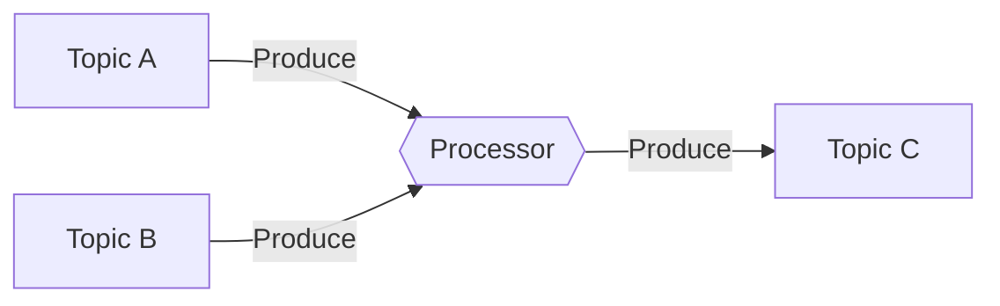
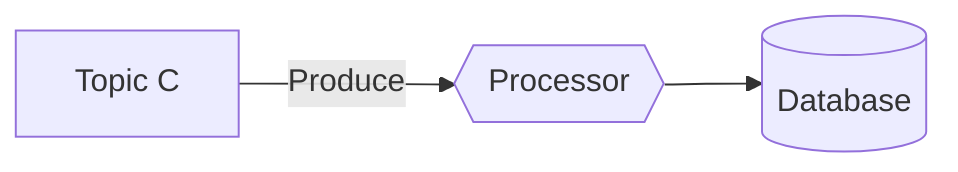
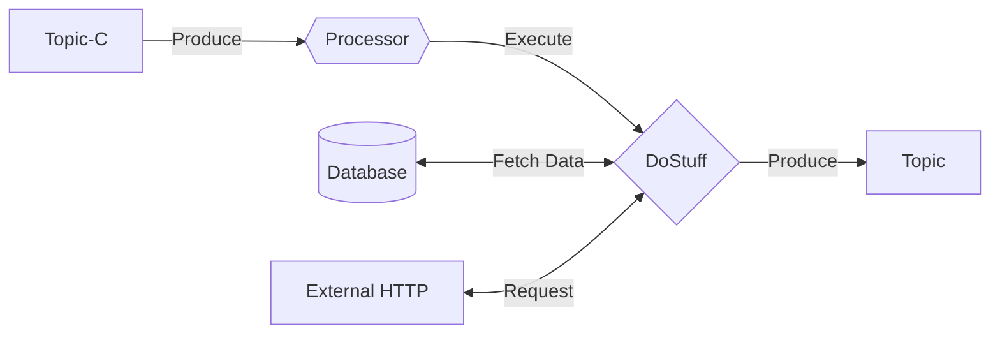
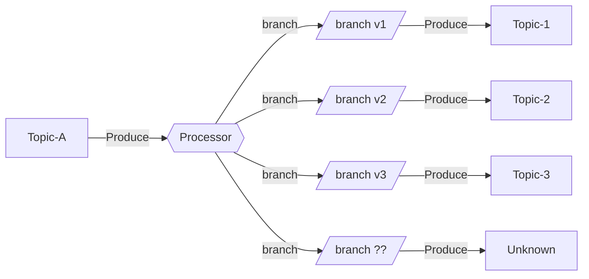
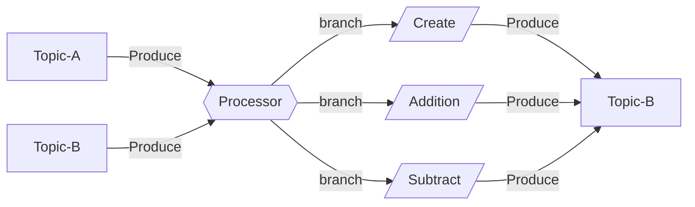

# MinimalKafka

 
 
 
 
 
[](https://github.com/pmdevers/MinimalKafka/actions/workflows/security-analysis.yml)


MinimalKafka is a Kafka consumer library designed to consume messages similarly to a Minimal API. This repository provides a streamlined and efficient way to work with Kafka consumers in .NET 8.0.


## Features

- Simple and minimalistic Kafka consumer setup
- Built to integrate seamlessly with .NET 8.0 applications
- Utilizes the Confluent.Kafka for robust Kafka interactions

## Installation

To install MinimalKafka, use the NuGet package manager:

```bash
dotnet add package MinimalKafka
```
## Usage

### Setting Up a Kafka Consumer

Below is a basic example of how to set up a Kafka consumer using MinimalKafka. For more detailed examples, refer to the `example` folder in the repository.

```csharp
using MinimalKafka;

var builder = WebApplication.CreateBuilder(args);

.Services.AddMinimalKafka(config => 
{ 
    config.WithBootstrapServers("localhost:9092")
          .WithGroupId(Guid.NewGuid().ToString())
          .WithOffsetReset(AutoOffsetReset.Earliest); 
});

var app = builder.Build();

app.MapTopic("topic.name", (string key, string value) => {
    
    // Implement your code here
    return Task.CompletedTask;

}).WithGroupId("Topic 2");

await app.RunAsync();

```


### Kafka Stream Processing

Often we want to join 2 topics and produce the outcome of this into a new topic



#### Join Streams

This can be achieved with the following code

```csharp

// Join 2 streams
app.MapStream<Guid, DatamodelA>("topic-a")
   .Join<Guid, DatamodelB>("topic-b").OnKey()
   .Into(async (c, k, v) =>
    {
        await c.ProduceAsync<Guid, DatamodelC>("topic-c", k, new(k, v.Item1.DataA, v.Item2.DataB));
    });
```

#### Store Projection

Each service who is interested in this can consume this model and store this for later use.



```csharp
// Project to local storage
app.MapStream<Guid, DatamodelC>("topic-c")
    .Into(async (c, _, v) =>
    {
        var store = c.RequestServices.GetRequiredService<IStore>();
        await store.SaveAsync(v);
    });

```

#### Stream Proccessing

Or some other complicated stuff and produce to other topic



```csharp
app.MapStream<Guid, DatamodelC>("topic-c")
    .Into(async (c, _, v) =>
    {
        // Some Extreme Complicated task.
        var result = DoStuff();

        await c.ProduceAsync("other-topic", result.Id, result);
    });
```

## Stream Branching

You could also branch a topic in different topics for different processes



```csharp

app.MapStream<Guid, DatamodelA>("topic-a")
   .SplitInto(x =>
   {
       x.Branch((_, v) => v.DataA == "v1", (c, k, v) => c.ProduceAsync("topic-1", k, v));
       x.Branch((_, v) => v.DataA == "v2", (c, k, v) => c.ProduceAsync("topic-2", k, v));
       x.Branch((_, v) => v.DataA == "v3", (c, k, v) => c.ProduceAsync("topic-3", k, v));
       x.DefaultBranch((c, k, v) => c.ProduceAsync("unknown", k, v));
   });
```

## Streaming Command Proccessor




```csharp
app.MapStream<Guid, DatamodelA>("topic-a")
   .Join<Guid, DatamodelB>("topic-b").OnKey()
   .SplitInto(x =>
   {
       // Initial Create Command
       x.Branch((_, v) => v.Item1?.DataA == "Create", async (c, k, v) => {
           if(v.Item2 != null) 
            {
               return;
           }
           await c.ProduceAsync("topic-b", k, new DatamodelB(k, 1));
       });

       // Add Command
       x.Branch((_, v) => v.Item1?.DataA == "Addition", async (c, k, v) =>
       {
           if(v.Item2 == null) 
           { 
               return;
           }

           await c.ProduceAsync("topic-b", k, v.Item2 with { DataB = v.Item2.DataB + 1 });
       });
       
       // Subtract Command
       x.Branch((_, v) => v.Item1?.DataA == "Subtract", async (c, k, v) =>
       {
           if (v.Item2 == null)
           {
               return;
           }

           await c.ProduceAsync("topic-b", k, v.Item2 with { DataB = v.Item2.DataB - 1 });
       });
   });
```


In this way you can chain topics together without interfering chancing 


## Contribution

Contributions are welcome! Please submit a pull request or open an issue to discuss your ideas or improvements.

## License

This project is licensed under the MIT License.

## Contact

For any questions or support, please open an issue in the repository.