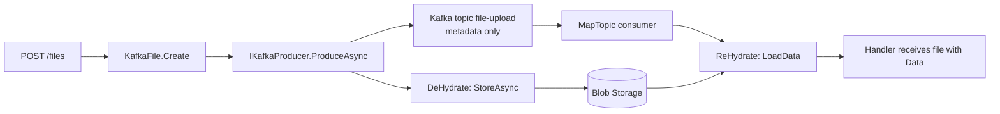

# The Claims-Check Pattern with KafkaFile

Kafka is not built for large payloads. Brokers have a default message limit of 1&nbsp;MB, and even when you raise it, big messages hurt throughput, replication and consumer memory.

The **Claims-Check Pattern** solves this: the payload is stored in external storage (blob storage, a file share, a database), and only a small *claim check* — an identifier plus metadata — travels through Kafka. Consumers use that claim check to retrieve the payload again.

MinimalKafka implements this pattern with two building blocks:

- `KafkaFile` — the claim check record that describes a binary file.
- `IKafkaFileStore` — the pluggable storage abstraction that holds the actual bytes.

Dehydration (on produce) and rehydration (on consume) happen automatically, so your handlers just see a normal object with a populated `KafkaFile` property.

## Diagram



## KafkaFile

```csharp
public record KafkaFile(Guid Id, string Filename, string ContentType, ReadOnlyMemory<byte> Data)
{
    public static KafkaFile Create(string filename, string contentType, ReadOnlyMemory<byte>? data = null);
    public static KafkaFile Empty { get; }
}
```

`KafkaFile` has a custom `JsonConverter`, which is what makes the claims-check work. When serialized to Kafka it writes only:

```json
{
  "id": "0b2b9f4e-7a0a-4f6a-9d2e-1b0a5e4c6d31",
  "filename": "invoice.pdf",
  "contentType": "application/pdf",
  "length": 184320
}
```

The `Data` bytes are deliberately **not** written to the topic, and on deserialization `Data` starts out as `ReadOnlyMemory<byte>.Empty`. The `Id` is the claim check used to find the bytes again in the store.

## IKafkaFileStore

```csharp
public interface IKafkaFileStore : IDisposable
{
    Task StoreAsync(KafkaFile kafkaFile);
    Task<KafkaFile> LoadData(KafkaFile kafkaFile);
}
```

Implement this interface to plug in your own storage backend. If you do not register a store, MinimalKafka uses a no-op store, which means `Data` is simply dropped — useful for tests, but not for real transfers.

### Example: Azure Blob Storage

From the `FileTransfer` example project:

```csharp
public class AzureBlobStorage(IOptions<FileTransferOptions> options) : IKafkaFileStore
{
    private readonly BlobContainerClient _containerClient =
        new(options.Value.BlobStorageConnectionString, options.Value.BlobContainerName);

    public async Task StoreAsync(KafkaFile kafkaFile)
    {
        await _containerClient.CreateIfNotExistsAsync();
        var blobClient = _containerClient.GetBlobClient(kafkaFile.Id.ToString("N"));

        await using var stream = new MemoryStream(kafkaFile.Data.ToArray());
        await blobClient.UploadAsync(stream, overwrite: true);
        await blobClient.SetHttpHeadersAsync(new BlobHttpHeaders
        {
            ContentType = kafkaFile.ContentType
        });
    }

    public async Task<KafkaFile> LoadData(KafkaFile kafkaFile)
    {
        await _containerClient.CreateIfNotExistsAsync();
        var blobClient = _containerClient.GetBlobClient(kafkaFile.Id.ToString("N"));

        if (!await blobClient.ExistsAsync())
        {
            return kafkaFile;
        }

        var content = await blobClient.DownloadContentAsync();

        return kafkaFile with
        {
            Data = content.Value.Content.ToMemory()
        };
    }

    public void Dispose() => GC.SuppressFinalize(this);
}
```

Note that `kafkaFile.Id` is the only thing linking the Kafka message to the stored blob. Using `Id.ToString("N")` as the blob name keeps the lookup trivial.

## Registering the store

Use `WithFileStore<TStorage>` on the config builder:

```csharp
services.AddMinimalKafka(config =>
{
    config.WithConfiguration(builder.Configuration.GetSection("Kafka"));
    config.WithJsonSerializers(x => x.PropertyNameCaseInsensitive = true);
    config.WithInMemoryStore();
    config.WithFileStore<AzureBlobStorage>();
});
```

The `FileTransfer` example wraps this in its own extension method so the configuration stays readable:

```csharp
public static class MinimalKafkaBlobStoreExtensions
{
    extension(IKafkaConfigBuilder builder)
    {
        public IKafkaConfigBuilder WithAzureBlobFileStore()
            => builder.WithFileStore(x => x.GetRequiredService<AzureBlobStorage>());
    }
}

// usage
config.WithAzureBlobFileStore();
```

The overload taking a factory is useful when the store needs options or other services resolved from the container.

## Producing files

Create a `KafkaFile` and put it on the message you produce. The producer dehydrates it for you — no explicit `StoreAsync` call needed.

```csharp
public class UploadFile
{
    public static async Task<IResult> Handle(
        [FromServices] IKafkaProducer producer,
        IFormFileCollection files)
    {
        var list = new List<KafkaFile>();

        foreach (var file in files)
        {
            using var stream = new MemoryStream();
            file.CopyTo(stream);

            var kFile = KafkaFile.Create(file.FileName, file.ContentType, stream.ToArray());

            list.Add(kFile);

            await producer.ProduceAsync("file-upload", Guid.NewGuid(), new
            {
                File = kFile
            });
        }

        return TypedResults.Ok(list);
    }

    public record FileUpload(KafkaFile File);
}
```

What happens on `ProduceAsync`:

1. The producer calls `DeHydrate` on the value.
2. `DeHydrate` reflects over the value's properties and calls `StoreAsync` for every property of type `KafkaFile`.
3. The value is serialized; the converter writes metadata only.
4. The metadata message is produced to the topic.

## Consuming files

Map a consumer as usual. By the time your handler runs, `Data` is already filled in.

```csharp
app.MapTopic("file-upload", UploadFile.Consumer);
```

```csharp
public static async Task Consumer([FromValue] FileUpload fileUpload)
{
    var file = fileUpload.File;

    // file.Id, file.Filename, file.ContentType come from Kafka
    // file.Data was reloaded from the file store
    await File.WriteAllBytesAsync(file.Filename, file.Data.ToArray());
}
```

On consume the framework deserializes the message and then calls `ReHydrate`, which walks the `KafkaFile` properties and replaces each one with the result of `LoadData`.

## Manual hydration

The same extension methods are available directly on `IKafkaFileStore`, which is handy when you build a download endpoint or work outside the produce/consume pipeline:

```csharp
public static async Task<IResult> Handle(
    [FromServices] IKafkaFileStore store,
    [FromServices] IKafkaStore<Guid, FileUpload> uploads,
    Guid id)
{
    var upload = await uploads.FindByIdAsync(id);

    await store.ReHydrate(upload);           // fills Data on all KafkaFile properties
    // await store.DeHydrate(upload);        // writes Data of all KafkaFile properties

    return TypedResults.File(upload.File.Data.ToArray(), upload.File.ContentType, upload.File.Filename);
}
```

Both `DeHydrate` and `ReHydrate` accept any `object?` and only act on public properties of type `KafkaFile`. Nested objects and collections of `KafkaFile` are not traversed — keep the claim check on a top level property.

## Benefits

- **No broker limits**: message size stays constant regardless of file size.
- **Faster brokers**: less data to replicate, retain and rebalance.
- **Transparent**: handlers work with ordinary objects; hydration is automatic.
- **Pluggable**: swap blob storage for S3, a file share or a database by implementing one interface.
- **Cheap replay**: reprocessing a topic does not resend gigabytes of payload.

## Use Cases

- Document and media ingestion pipelines.
- EDI / batch file transfer between systems.
- Image or report generation workflows.
- Any event that carries an attachment larger than a few hundred kilobytes.

## Things to keep in mind

- **Lifetime**: Kafka retention and store retention are independent. Deleting blobs while the topic still references them leaves consumers with empty `Data`.
- **Missing data**: `LoadData` should return the original `KafkaFile` when the payload is gone, as the Azure example does. Handle an empty `Data` in your consumer.
- **Ordering**: the file is stored *before* the message is produced, so a consumer can never observe a claim check whose payload is not yet written.
- **Memory**: `Data` is held fully in memory. For very large files, consider storing a reference yourself and streaming from the store instead.
- **Security**: the store key is the file `Id`. Do not treat it as a secret, and apply authorization on any endpoint that serves files back.
