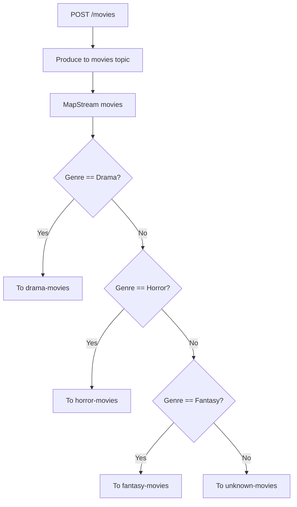

# Stream Branching in MinimalKafka
Stream branching allows you to split a Kafka stream into multiple branches based on custom logic. Each branch can process messages that match specific criteria, enabling targeted processing and routing.

## Example: Branching Movies by Genre

In the example below, movies are posted to a Kafka topic and then routed to different topics based on their genre:

```csharp

builder.MapPost("/movies", async (
    [FromServices] IKafkaProducer producer, 
    [FromBody] Movie movie) =>
{
    await producer.ProduceAsync("movies", movie.Id, movie);
});

builder.MapStream<Guid, Movie>("movies")
    .SplitInto(x => {
        x.Branch((k, v) => v.Genre == Genre.Drama).To("drama-movies");
        x.Branch((k, v) => v.Genre == Genre.Horror).To("horror-movies");
        x.Branch((k, v) => v.Genre == Genre.Fantasy).To("fantasy-movies");
        x.DefaultBranch("unknown-movies");
    });

```

## Diagram



## How It Works
- MapPost: Accepts movie data and produces it to the "movies" topic.
- MapStream: Consumes the "movies" topic as a stream of Movie records.
- SplitInto: Defines branching logic:
    - Each Branch specifies a predicate to match a genre and routes matching messages to a specific topic.
    - DefaultBranch handles any messages that do not match previous branches.

## Benefits

- **Separation of Concerns**: Each branch processes only relevant messages.
- **Scalability**: Downstream consumers can subscribe to specific topics.
- **Maintainability**: Branch logic is centralized and easy to update.

## Use Cases

- Routing events by type or priority.
- Filtering messages for different microservices.
- Implementing content-based routing in event-driven architectures.
